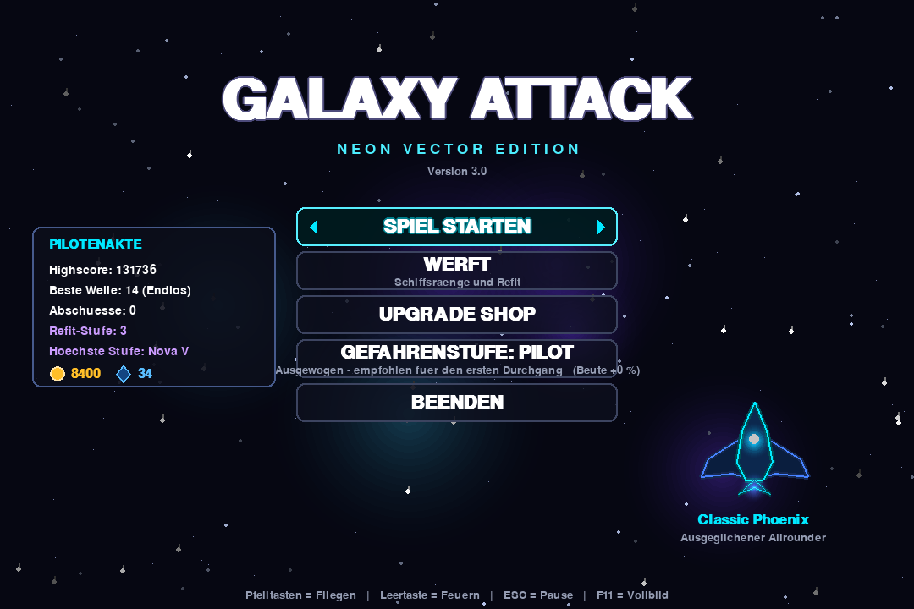
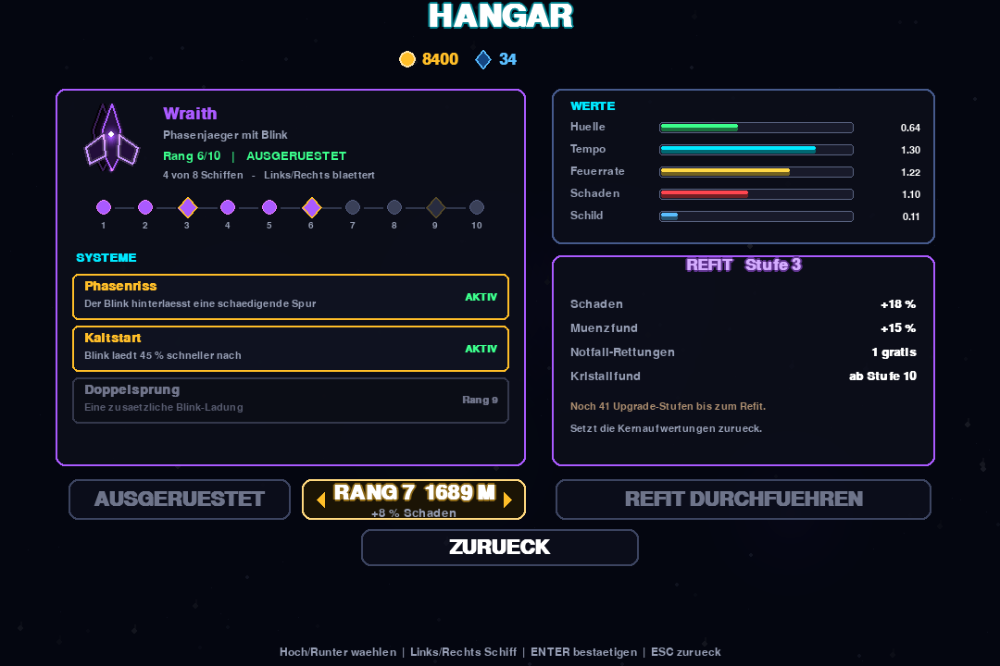
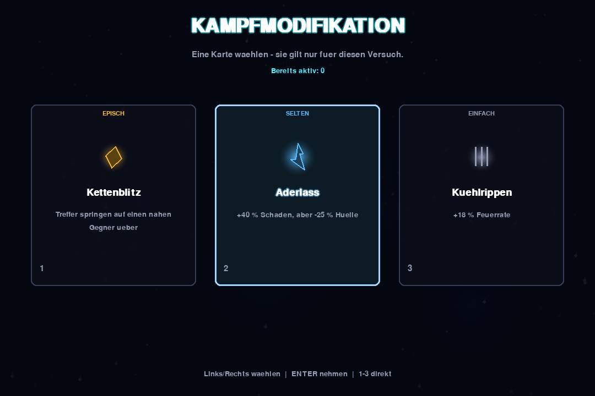
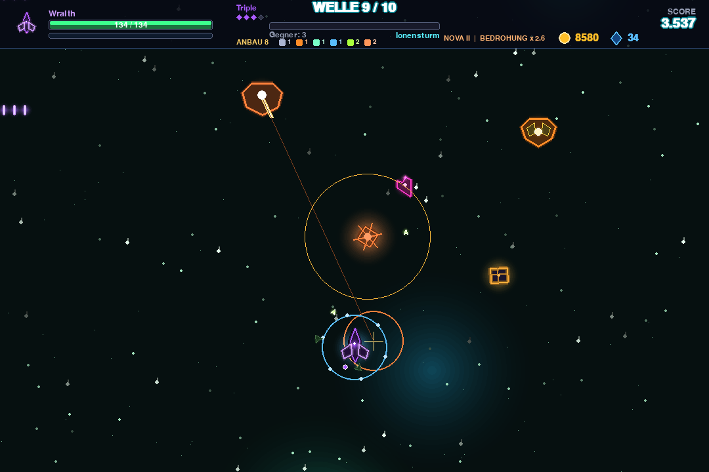
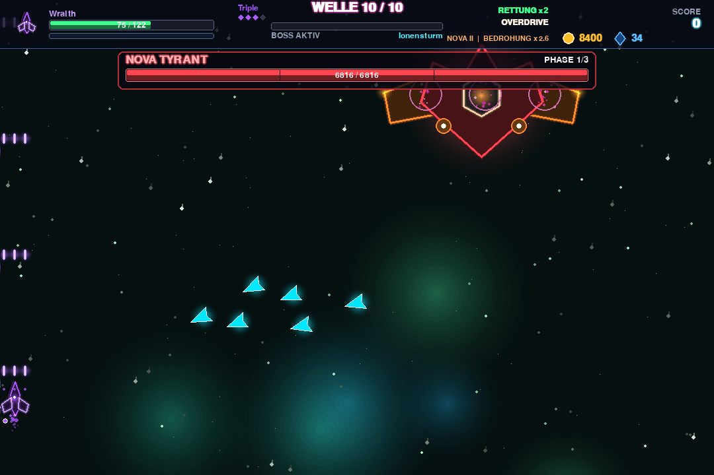
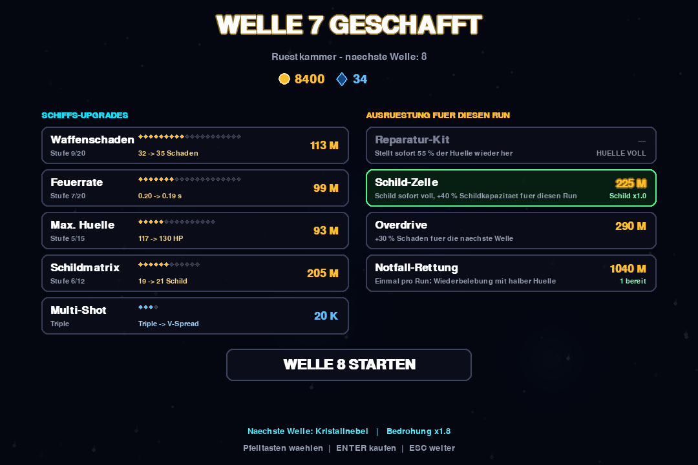
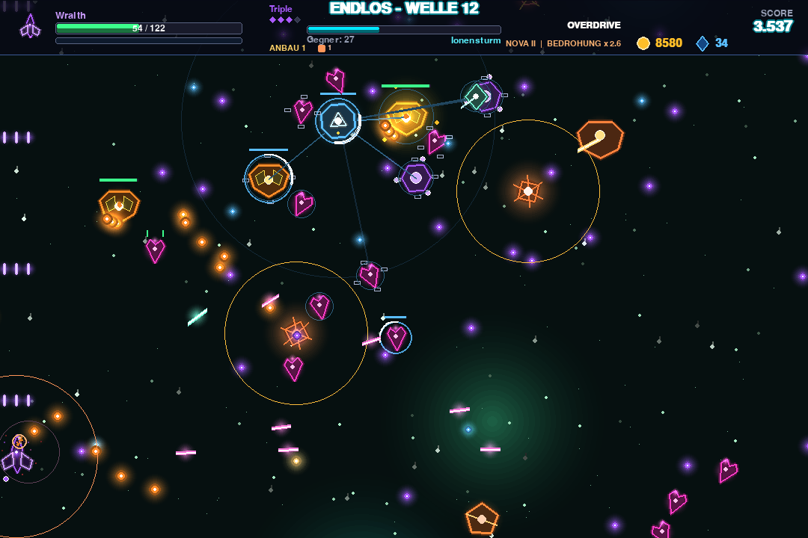

# Galaxy Attack — Neon Vector Edition

Ein kompletter Arcade-Weltraumshooter in **einer einzigen Python-Datei**.
Jede Grafik entsteht zur Laufzeit aus `pygame.draw` — es gibt keine einzige
Bilddatei im Spiel.



---

## Sofort spielen

**Windows, ohne Nachdenken:** Repository als ZIP herunterladen
(*Code → Download ZIP*), entpacken und **`Galaxy Attack einrichten.bat`**
doppelklicken. Das Skript prüft Python, installiert pygame falls nötig, legt
das Spiel unter `Desktop\Galaxy Attack` ab und erstellt eine Verknüpfung mit
eigenem Icon.

**Alle Systeme:**

```bash
pip install pygame
python space_shooter.py
```

Getestet mit Python 3.11 sowie pygame 2.5.2 und 2.6.1. Außer pygame wird
nichts benötigt.

---

## Steuerung

| Taste | Wirkung |
|---|---|
| Pfeiltasten | Fliegen, alle acht Richtungen |
| Leertaste | Feuer, halten für Dauerfeuer |
| Shift | Blink — nur mit der *Wraith* |
| Esc | Pause und zurück |
| Enter | Auswahl bestätigen, kaufen |
| 1 / 2 / 3 | Karte direkt wählen |
| F11 | Vollbild |

---

## Was drin ist

**Acht Schiffe, fünf davon mit einer eigenen Regel.** Die *Wraith* springt per
Blink mit kurzer Unverwundbarkeit durch den Beschuss, die *Bastion* lässt zwei
Kugeln kreisen, die gegnerische Geschosse zerstören, die *Hydra* feuert
zusätzlich nach hinten und zur Seite, die *Helios* lädt statt zu feuern einen
durchschlagenden Strahl auf, und die *Locust* schickt drei Drohnen mit
Zielsuchraketen los.



**Zehn Ränge je Schiff**, davon drei mit einem freischaltbaren *System* — einer
echten Fähigkeit statt eines Prozentwerts. Über die Flotte sind das 24 Systeme.

**Refit ohne Ende.** Sind alle Kernaufwertungen maximal, setzt ein Refit sie
zurück und gibt dauerhaft mehr Schaden und Münzfund. Die Boni fließen in die
adaptive Schwierigkeit ein, damit die Gegner mitziehen.

**30 Kampfmodifikationen.** Nach jeder Welle werden drei Karten gezogen, eine
wird gewählt — und gilt nur für den laufenden Versuch.



**Acht Gegnertypen mit Mutationen.** Abfangjäger, gepanzerte Bomber,
Kamikaze-Drohnen, Geschützplattformen, Teiler, Scharfschützen mit sichtbarer
Ziellinie und Schildgeber, die andere Gegner schützen. Ab Welle 8 kommen
**Mörserschiffe** dazu: sie werfen langsame, große Minen mit sehr hohem
Schaden — sichtbar angekündigt durch eine Zielmarke, und abschießbar, wenn
man rechtzeitig reagiert. Einzelne Gegner spawnen mit Zusatzmodulen: Schild,
Schnellfeuer, Panzerung, Sprint oder Elite.

**Frachtkisten mit Anbauten.** Selten lässt ein Abschuss eine Kiste fallen,
jeder Boss garantiert eine. Was drin ist, entscheidet der Würfel: ein
Aegis-Ring, der zu jedem Wellenstart einen zweiten Schild um das Schiff legt,
eine mitfliegende Begleitdrohne, eine zusätzliche Laserbahn, ein Flakwerfer,
der Geschosse in der Nähe wegräumt — oder eben nur ein paar Prozent mehr
Hülle. Anbauten gelten für den laufenden Versuch.



*Aegis-Ring und Flakring um das Schiff, zwei Begleitdrohnen, oben links ein
Mörser mit Ziellinie, in der Mitte seine Mine mit Sprengradius, rechts eine
Frachtkiste.*

**Bosse mit Bollwerk-Phasen.** Bei festen Lebensanteilen wird der Boss immun,
ruft Schildgeneratoren und eine Begleitwelle. Erst wenn die Generatoren fallen,
ist er wieder verwundbar — und danach jedes Mal aggressiver.



**Endlosmodus.** Keine Welle ist von Hand gebaut; ein Generator entscheidet aus
Wellennummer und Spielerstärke über Typen, Menge und Formationen. Nach dem Sieg
in Welle 10 geht es auf Wunsch endlos weiter, alle vier Wellen wechselt die
Kulisse.

**Eine Gefahrenleiter, acht Stufen.** Von *Kadett* (Gegner ziehen kaum mit,
weniger Schaden) über *Pilot* und *Veteran* bis *Nova I–V*. Jede Nova-Stufe
schaltet eine zusätzliche Erschwernis dazu — mehr Gegnerpanzerung, keine
Herzen, ein zweites Bollwerk beim Boss, Trümmerfelder, kein Schildregen — und
zahlt dafür mehr Beute, bis zu +175 %. Die ersten drei Stufen sind immer
offen; darüber muss man sich jede Stufe einzeln erspielen.



---

## Adaptive Schwierigkeit

Das Spiel misst laufend, wie weit dein Schiff über der Startausrüstung liegt,
und passt die Gegner an. Entscheidend: Sie wachsen **unterproportional** mit,
alle Exponenten liegen unter 1. Ein Upgrade macht dich also weiterhin spürbar
stärker — der Boss zerbröselt nur nicht mehr in fünfzehn Sekunden.

Eine Anlauframpe sorgt dafür, dass die ersten Wellen unverändert zugänglich
bleiben; die Anpassung fährt erst bis Welle 8 voll hoch.



---

## Statistik und Balance

Jede Partie wird in `galaxy_attack_stats.db` protokolliert — Runde, jede
einzelne Welle, jeder Tod mit Ursache und jeder Kauf. Der eingebaute Report
wertet das aus und markiert Auffälligkeiten selbst:

```bash
python space_shooter.py --stats
```

Er zeigt Wellen mit niedriger Abschlussquote, Gegner mit auffällig hohem
Todesanteil und Bosskämpfe außerhalb des Zielfensters.

**Statistik weitergeben.** Eine `.db` ist eine Binärdatei und lässt sich nicht
überall anhängen. Deshalb gibt es einen Export als reine Textdatei — erst der
lesbare Report, danach jede Tabelle vollständig als CSV:

```bash
python space_shooter.py --export
```

Das schreibt `galaxy_attack_export.txt` neben das Spiel. Unter Windows genügt
ein Doppelklick auf **`Statistik exportieren.bat`**; das Skript sucht das Spiel
selbst, erzeugt die Datei und öffnet den Ordner. In der Datei stehen nur
Spielwerte — Welle, Schaden, Abschüsse, Käufe —, keine persönlichen Daten.

---

## Dateien

| Datei | Zweck |
|---|---|
| `space_shooter.py` | Das komplette Spiel |
| `Galaxy Attack einrichten.bat` | Windows-Einrichtung mit Desktop-Verknüpfung |
| `Statistik exportieren.bat` | Macht aus der Statistik eine verschickbare Textdatei |
| `galaxy_attack.ico` | Icon, gerendert aus der Schiffsgrafik des Spiels |

Beim Spielen entstehen daneben `galaxy_attack_save.json` (Fortschritt) und
`galaxy_attack_stats.db` (Statistik). Beide gehören dir, nicht dem Repository —
löschen setzt den Fortschritt zurück.

---

## Läuft wirklich die neue Version?

Im Hauptmenü steht unter dem Titel eine **Versionsnummer**. Fehlt sie oder ist
sie älter als hier im Repository, startet die Verknüpfung noch eine alte Kopie:
das Einrichtungsskript legt das Spiel unter `Desktop\Galaxy Attack` ab, eine
neue Datei im Download-Ordner ersetzt sie nicht. In dem Fall die neue
`space_shooter.py` einfach über die Datei in `Desktop\Galaxy Attack` kopieren
oder das Einrichtungsskript erneut ausführen.
